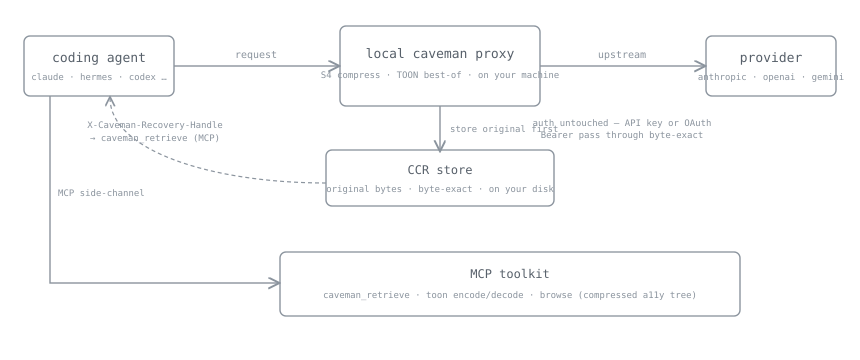
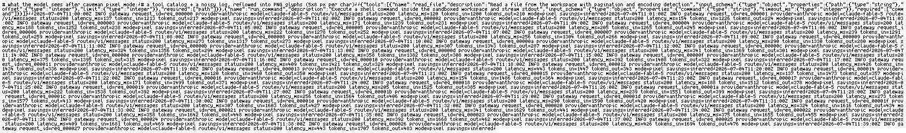
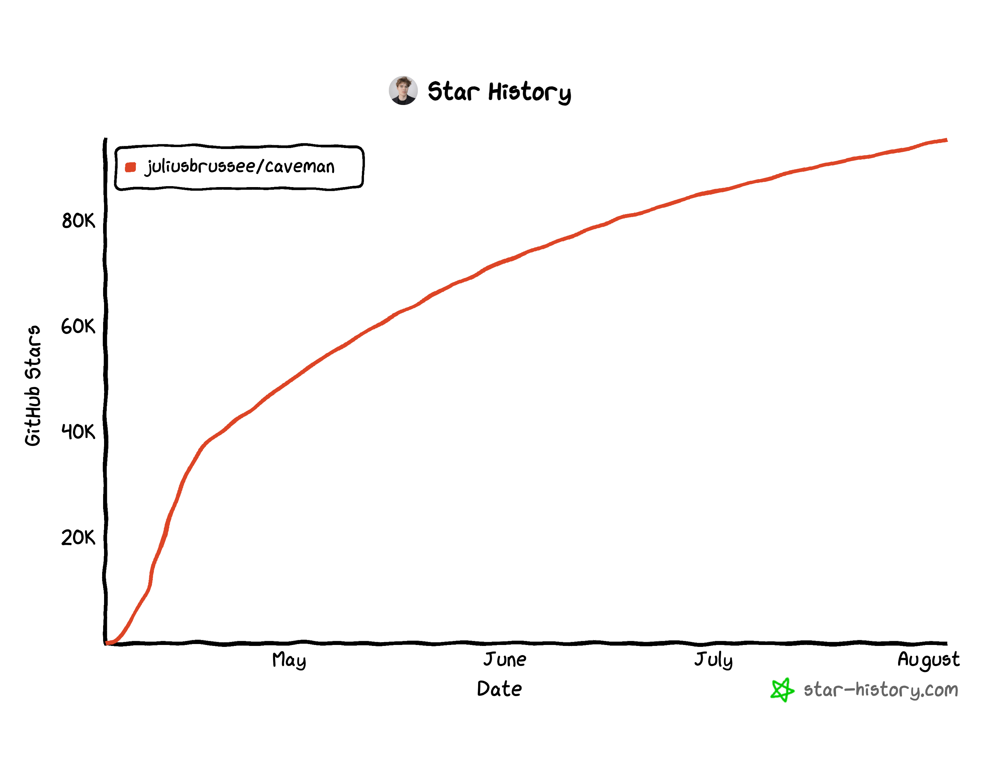

<p align="center">
  
</p>

<p align="center">
  <strong>why use many token when few do trick</strong>
</p>

<p align="center">
  Original skill made agents say less. Caveman 2 makes them read less too.<br>
  <strong><a href="./docs/WRAP-BENCHMARK.md">33.2% fewer provider-reported input tokens</a> in a pinned Claude Code benchmark.</strong> <code>benchmark_counterfactual</code><br>
  Keep your agent. Brain big. Context small.
</p>

<p align="center">
  <a href="https://www.producthunt.com/products/caveman?embed=true&amp;utm_source=badge-featured&amp;utm_medium=badge&amp;utm_campaign=badge-caveman-2" target="_blank" rel="noopener noreferrer"></a>
  <a href="https://trendshift.io/repositories/25391?utm_source=repository-badge&amp;utm_medium=badge&amp;utm_campaign=badge-repository-25391" target="_blank" rel="noopener noreferrer"></a>
</p>

<p align="center">
  <a href="https://github.com/JuliusBrussee/caveman/stargazers"></a>
  <a href="./INSTALL.md"></a>
  <a href="#wrap-any-agent"></a>
  <a href="#license"></a>
  <a href="https://skills.sh/JuliusBrussee/caveman"></a>
</p>

<p align="center">
  <a href="#see-it">See it</a> ·
  <a href="#install">Install</a> ·
  <a href="#where-your-tokens-go">Learn</a> ·
  <a href="#caveman-proxy">Proxy</a> ·
  <a href="#pixel-mode">Pixel</a> ·
  <a href="#wrap-any-agent">Wrap</a> ·
  <a href="./docs/README.md">Docs</a> ·
  <a href="#license">License</a>
</p>

---

## See it

<table>
<tr>
<th width="50%">🗣️ Normal agent — 69 tokens</th>
<th width="50%"> Caveman agent — 19 tokens</th>
</tr>
<tr>
<td valign="top">

> The reason your React component is re-rendering is likely because you're creating a new object reference on each render cycle. When you pass an inline object as a prop, React's shallow comparison sees it as a different object every time, which triggers a re-render. I'd recommend using useMemo to memoize the object.

</td>
<td valign="top">

> New object ref each render. Inline object prop = new ref = re-render. Wrap in `useMemo`.

</td>
</tr>
</table>

Same fix, fewer words. That was Caveman 1. Agent mouth got smaller. Appetite did not: tool schemas, files, logs, and history still cross the wire in full, every turn. Caveman 2 shrinks that too.

## Install

Two products. Pick one or both.

**Save input** with Caveman Proxy, the new release. A local proxy that shrinks what your agent reads before every provider call, with byte-exact recovery. BSL-1.1 runtime, MIT CLI.

```bash
npm install -g @caveman-ai/cli && caveman setup --install
caveman claude        # or codex · gemini · aider · opencode · hermes · openclaw
```

**Save output** with the skill, the original. Your agent answers in tight caveman-speak while code, commands, and errors stay byte-for-byte exact. MIT, works in 30+ agents.

```bash
npx skills add JuliusBrussee/caveman
```

<details>
<summary>Full installer, Windows, one agent only, uninstall</summary>

The full installer also wires the Claude Code hooks and statusline, finds every supported agent on your machine, and is safe to rerun (Node.js 18+):

```bash
curl -fsSL https://raw.githubusercontent.com/JuliusBrussee/caveman/v2.1.0/install.sh | bash
```

Windows (PowerShell 5.1+):

```powershell
irm https://raw.githubusercontent.com/JuliusBrussee/caveman/v2.1.0/install.ps1 | iex
```

One agent only:

```bash
# Claude Code
claude plugin marketplace add JuliusBrussee/caveman && claude plugin install caveman@caveman

# Gemini CLI
gemini extensions install https://github.com/JuliusBrussee/caveman

# Codex, Cursor, Windsurf, Cline, and other skills-compatible agents
npx skills add JuliusBrussee/caveman --skill '*' -a codex --yes  # replace codex with your agent profile
```

Full 30+ agent matrix, dry run, flags, verification, and uninstall: [INSTALL.md](./INSTALL.md).

Prefer building the proxy from source instead of signed binaries? `scripts/install-local-cli.sh` (macOS/Linux) or `pwsh -File scripts/install-local-cli.ps1` (Windows); needs Go and `pnpm`.

</details>

## Where your tokens go

You have months of agent history on disk. `caveman learn` reads it and scores your setup. Local, read-only, no account.

```bash
caveman learn             # scan Claude Code + Codex history, open the report
```

<p align="center">
  
</p>

The report shows your Cave Score, every token sink ranked by flow with a one-line fix behind each row, how deep each session ran into its context window, a replay of what the fixes would have cut from your past sessions, and a list-price illustration of what the ranked sinks cost over 30 days. Sink and cost numbers are `inferred`; the saved-so-far card is proxy-measured. None of it is a bill.

Every sink wears its class: **safe fix** (a bloated CLAUDE.md, a skill you never invoke), **offload** (context you re-paste every session, moved to caveman memory when recall measures cheaper), **habit** (numbers plus a soft suggestion, never an imperative), **load-bearing** (config you need, counted in the score and never touched).

```bash
caveman learn implement   # hand the plan to Claude Code or Codex
```

The analyzer never edits your files. `learn implement` opens your own agent with the plan and the `caveman-learn` skill, which instructs it to propose each fix as a diff, apply only on your yes, re-measure, and revert anything that did not lower tokens per turn. Caveman never makes your agent dumber to make it cheaper.

## Caveman Proxy

One command wraps your agent and routes provider traffic through a local proxy powered by Caveman Engine. In a pinned 54-run Claude Code benchmark it used **33.2% fewer provider-reported input tokens** than direct Claude Code while passing all 18 exact-answer checks. [Method, per-case results, and limits.](./docs/WRAP-BENCHMARK.md) `benchmark_counterfactual`

No code change, no Caveman backend: the proxy forwards each request to your chosen provider, and recovery copies stay on your disk. Claude Pro/Max OAuth credentials pass through to Anthropic as-is.

<p align="center">
  
</p>

| Mode | What it does | Bytes the model sees |
|---|---|---|
| default stack *(`caveman claude`)* | Structural compression routed per content type, plus JSON tool results re-encoded as TOON when measured smaller. | Changed, recoverable |
| `--off` | Counts tokens and cost. Changes nothing. | **Byte-identical** |
| `--pixel` | Dense text slabs rendered to PNG pages for vision models. | Changed, recoverable |

Three rules keep it safe:

- **CCR first.** Original bytes land in a content-addressed store on your disk before any lossy transform ships. The agent pulls them back with `caveman_retrieve`. Parse problem, store failure, or larger result sends original bytes unchanged.
- **Visible declines.** Every transform runs only when it measures smaller, and every decline states its reason.
- **Labeled evidence.** Local results say `inferred`. `verified` requires real traffic and eval gates; offline caveman never says it.

<details>
<summary><strong>What the engine does to a payload</strong> — per-type compressors and targets</summary>

`detect()` types each payload, then routes it to a compressor that keeps what answers depend on:

| Detected type | Keeps | Target |
|---|---|---|
| `json` | keys, structure, error/message subtrees; collapses repetitive arrays | 70–90% |
| `log` | errors, stack traces, first/last lines; drops INFO and progress noise | 85–95% |
| `code` | imports, signatures, types; elides function bodies, syntax stays valid | 40–70% |
| `diff` | file/hunk headers and changed lines; elides repeated context | 60–80% |
| `search-result` | top/bottom hits plus diagnostic/security hits | 80–95% |
| `text` / HTML | headings, opening/closing context, important sections | 50–80% |

All targets `inferred`. The code compressor uses tree-sitter (Go, Python, JS/TS) under cgo, with a pure-Go fallback that handles Go only. `contextwindow.Pack()` additionally fits candidate context into a token budget by BM25 relevance, recency, and error signal, returned in original order so chronology survives.

</details>

The same engine powers a set of verbs:

```bash
caveman learn                   # scan your real agent history → score + ranked token sinks
caveman learn implement         # fix the findings with your own agent, consent-gated per edit
caveman explore install         # read-only FastContext subagent: finds code as path:line
caveman shrink -- pnpm test     # compress noisy command output, byte-exact recoverable
caveman browse <url>            # local Chrome over a compressed a11y tree
caveman mem remember|recall     # durable memory; `mem recover <handle>` = original bytes
caveman trial -- claude         # A/B a real session, then `trial report`
caveman toon encode|decode      # the TOON re-encoder, standalone
caveman stats                   # what caveman actually did, by content type
```

The MCP server exposes five tools to any MCP host: `caveman_compress`, `caveman_retrieve`, `caveman_stats`, `caveman_toon_encode`, `caveman_toon_decode`.

On browse (needs Chrome): a focused query against a 200-row operations table costs **121 tokens, 129.8× smaller** than the Playwright ARIA baseline of 15,704. On a tiny checkout form Caveman is honestly larger (67 → 111 tokens) because it also returns action UIDs and a recovery handle, and the Playwright baseline carries only ARIA text, which favors Playwright. Medians over five pinned Chrome runs, `inferred`. Full method: [`browse/BENCHMARK.md`](./browse/BENCHMARK.md).

## Pixel mode

The headline trick. Text is priced per token; images are not. A dense wall of text rendered to a PNG costs a fraction as vision input, so the proxy renders big request slabs (minified JSON tool catalogs, long-line logs, old history) into glyph-rendered PNG pages.

```bash
caveman wrap --pixel claude
```

<p align="center">
  
</p>

<p align="center">
  <sub>Real render, bundled here: 8,622 chars → one 1568×232 PNG, est. <strong>2,597 text → 534 image tokens</strong>, <code>inferred</code>.</sub>
</p>

On a genuinely dense request (a 63.7k-char minified JSON tool-catalog slab plus a 93k-char long-line log, model `claude-fable-5`):

```
55,413 est. text tokens  →  11,402 est. image tokens   ·  −79%  ·  7 PNG pages  ·  inferred
```

Originals go to CCR first; the agent pulls real bytes back via `caveman_retrieve`.

> [!IMPORTANT]
> **Pixel only pays on dense, long-line content.** Sparse code with short lines is honestly *not* profitable: the PNG carries more overhead than the text it replaces, so the profitability gate declines it and the bytes pass through untouched.

Runs only for models with measured render legibility, `claude-fable-5` and `gpt-5.6` by default; override with `pixel_models` config / `CAVE_PIXEL_MODELS`. Pixel ports [pxpipe](https://github.com/teamchong/pxpipe) (MIT); font attribution in the [License](#license).

### Skills as images

Full circle: the engine now compresses the thing caveman started as. Every fat skill you install re-loads its whole prompt body on every invocation, and you pay that tax forever. `caveman convert` renders each installed `SKILL.md` body to PNG pages in place. Frontmatter stays text, so discovery and triggering work exactly as before; the model reads the body as an image.

```bash
caveman convert --dry-run        # every installed skill, with the token math, no writes
caveman convert --agent claude   # convert the profitable ones
caveman convert --revert         # byte-identical restore from SKILL.orig.md
```

Measured on the caveman skill itself: **1,069 → 415 est. tokens, −61%**, `inferred`. Convert only fires when pages beat the text; any failure leaves the skill byte-identical and names the gate that said no. New skills installed through `caveman skills install` auto-pixel by default (`--no-pixel` to opt out).

## The skill

The original, and still the fastest way to feel caveman. MIT forever. Works in [Claude Code](https://docs.anthropic.com/en/docs/claude-code), Codex, Gemini, Cursor, Windsurf, Cline, Copilot, and 30+ other agents.

Type `/caveman` if your agent does not activate it automatically. Switch with `/caveman lite|full|ultra|wenyan-lite|wenyan-full|wenyan-ultra`; turn it off with `/caveman off` or `normal mode`.

One install also brings the small tools:

| Tool / command | What you get |
|---|---|
| `/caveman [lite\|full\|ultra\|wenyan-lite\|wenyan-full\|wenyan-ultra\|off]` | Shorter replies at the intensity you choose. |
| `cavecrew-investigator`, `cavecrew-builder`, `cavecrew-reviewer` | Compressed subagent presets for locating, editing, and reviewing code. |
| `/caveman-commit` | Terse Conventional Commit messages. |
| `/caveman-review` | One-line, actionable review findings. |
| `/caveman-compress <file>` | Smaller Markdown memory files, with the original backed up. |
| `/caveman-stats` | Local session token usage and estimated savings in Claude Code. |

<!-- BENCHMARK-TABLE-START -->
| Task | Normal | Caveman | Saved |
|------|-------:|--------:|------:|
| Explain React re-render bug | 1180 | 159 | 87% |
| Fix auth middleware token expiry | 704 | 121 | 83% |
| Set up PostgreSQL connection pool | 2347 | 380 | 84% |
| Explain git rebase vs merge | 702 | 292 | 58% |
| Refactor callback to async/await | 387 | 301 | 22% |
| Architecture: microservices vs monolith | 446 | 310 | 30% |
| Review PR for security issues | 678 | 398 | 41% |
| Docker multi-stage build | 1042 | 290 | 72% |
| Debug PostgreSQL race condition | 1200 | 232 | 81% |
| Implement React error boundary | 3454 | 456 | 87% |
| **Average** | **1214** | **294** | **65%** |
<!-- BENCHMARK-TABLE-END -->

> [!IMPORTANT]
> **Honest number warning.** The skill only shrinks **output** tokens. Input and reasoning tokens are untouched, and the skill itself adds ~1–1.5k input tokens per turn. Whole-session savings run smaller than the output number, and on already-terse workloads they can go net-negative. The real win is **readability and speed**; cost savings are the bonus. When caveman wins, when it loses, and how to measure it yourself: **[docs/HONEST-NUMBERS.md](./docs/HONEST-NUMBERS.md)**.

## Wrap any agent

`caveman <agent>` wraps seven agents natively. Adding one is a data change, a single JSON profile in [`agents/profiles/`](./agents/profiles/), no code.

| Agent | Vendor | How it's wrapped |
|---|---|---|
| **Claude Code** | Anthropic | env vars |
| **OpenAI Codex CLI** | OpenAI | env vars (API key) · ephemeral `CODEX_HOME` (ChatGPT login) |
| **Gemini CLI** | Google | env vars |
| **Aider** | OpenAI/Anthropic | env vars |
| **opencode** | sst | inline config via env, your `opencode.json` untouched |
| **Hermes Agent** | Nous Research | `--provider custom` + env |
| **OpenClaw** | OpenClaw | ephemeral merged config, your config read-only |

Wrap never edits your own config files. Real sessions round-trip in record mode, tested against **Hermes v0.18.0** and **OpenClaw 2026.6.11**.

Not on the list? Point any provider SDK or framework (Vercel AI SDK, LangChain, LiteLLM, OpenAI Agents, CrewAI, PydanticAI) at the local proxy with a `baseURL` swap: [`integrations/recipes/`](./integrations/recipes/).

> [!NOTE]
> **Subscription logins work.** Claude Pro/Max OAuth tokens pass through the proxy as-is, so a wrapped Claude Code on a subscription gets full compression and metering. Codex ChatGPT logins wrap too: an ephemeral `CODEX_HOME` (your `~/.codex` is never written) points a custom provider at the proxy's `/chatgpt` passthrough, OAuth headers ride through byte-exact. That path is metering-only for now: honest token counts, dollars stay zero because subscription traffic has no per-token price. One exception: a provider pinned inside another agent (e.g. `openai-codex` inside OpenClaw) is left on its own path with a printed note instead of a broken login.

The default wrap hands the agent the whole loadout: the five caveman MCP tools, the browse MCP server when Chrome resolves, command-output shrink through a real hook on Claude, opencode, Gemini, Hermes, and OpenClaw (Codex gets an honest soft note, its runtime rejects the rewrite: [openai/codex#18491](https://github.com/openai/codex/issues/18491)), and [skills-as-images](#skills-as-images) on new skill installs. Turn pieces off in `~/.caveman-cloud/config.json`.

## The whole cave

One idea. **Agent do more with less.**

| Repo | What it shrinks | Status |
|------|------|------|
| [**caveman**](https://github.com/JuliusBrussee/caveman) *(you here)* | What the agent **says**, and now what it **reads** | live |
| [**caveman-browse**](https://github.com/JuliusBrussee/caveman-browse) | What the agent **sees in the browser** | live |
| **caveman-agent-sdk** | What your production agent **loads, calls, and spends** | own repo · in dev |
| [**cavegemma**](https://github.com/JuliusBrussee/cavegemma) | The compression **baked into weights** (Gemma fine-tune) | labs |
| [**caveman-code**](https://github.com/JuliusBrussee/caveman-code) | The **whole agent**, end to end | frozen |
| [**cavemem**](https://github.com/JuliusBrussee/cavemem) | What the agent **remembers**, across sessions | frozen |
| [**cavekit**](https://github.com/JuliusBrussee/cavekit) | The **build loop**, spec-driven | frozen |

Frozen repos still install and work; they are no longer in active development. Their best ideas live on here: cavemem's compressed-memory core ships inside caveman, and caveman-code's lesson became `caveman wrap`. Make the agent you already use cheaper instead of replacing it.

## From `inferred` to `verified`

**Caveman make token small. Caveman Cloud make it _provable_.**

Local runtime results report `inferred`; controlled benchmark results report `benchmark_counterfactual`. Neither is a provider invoice. Caveman Cloud is where qualifying live evidence can become `verified`: baseline in record mode, changes behind eval gates, rollback on quality loss, savings from real traffic with signed receipts. Offline caveman never says `verified`.

[**Join the waitlist → caveman.so**](https://caveman.so)

## Privacy

Your agent still talks to the provider you chose. Local compression needs no Caveman account. The `caveman` CLI sends anonymous usage stats by default: which commands ran, plus token counts through and cut. Never your prompts, code, or file paths. It says so on first run, and one command turns it off forever: `caveman telemetry off` (or `DO_NOT_TRACK=1`). Skill and hooks run locally; the proxy forwards provider traffic; CCR stays in a SQLite file on your disk. Exact network, telemetry, and storage boundaries: [SECURITY.md](./SECURITY.md).

## License

Split license. Skill and adoption surfaces are [MIT](./LICENSE). Engine-linked runtime is BSL-1.1 source-available, not OSI Open Source before Change Date.

**MIT** — the skill, Agent SDK and initializer, the CLI, both client SDKs (TS + Python), kit, evals/graders, contracts, provider catalog, the extension shell, and the thin cavemem clients.

**BSL-1.1** — Engine, Proxy, Cache Engine, rewriter, Browse, MCP server, `shrink`, cavemem Go core, and shared Go platform. New Engine-linked runtime modules default to BSL-1.1. Source-available: read it, fork it, self-host it for your own first-party traffic free, production included. Every BSL version auto-converts to **Apache-2.0** on the earlier of `2030-06-21` or four years after that version first ships. Third-party hosted, managed, or embedded service use needs commercial license. BSL text and per-directory map ship with source.

`engine/pixel` embeds [pxpipe](https://github.com/teamchong/pxpipe) (MIT) plus glyph atlases derived from Spleen 5×8 (BSD-2-Clause) and GNU Unifont (dual OFL-1.1 / GPLv2-with-font-exception); its `NOTICE` travels with that source.

"Caveman" and the rock logo are trademarks of Julius Brussee. "Powered by Caveman" is fine when true.

## Sponsors

Caveman free forever. Sponsors keep the rock sharp.

<p align="center">
  <a href="https://www.atlascloud.ai">
    <picture>
      <source media="(prefers-color-scheme: dark)" srcset="docs/assets/atlas-cloud-dark.svg">
      
    </picture>
  </a>
</p>

<p align="center">
  <a href="https://www.atlascloud.ai"><strong>Atlas Cloud</strong></a> — full-modal AI inference platform, one API.
</p>

<p align="center">
  <a href="https://github.com/sponsors/JuliusBrussee"><strong>Want your rock here? → Sponsor caveman</strong></a>
</p>

## Star this repo

Caveman save you token, save you money. Star cost zero. Fair trade. ⭐

[](https://star-history.com/#JuliusBrussee/caveman&Date)

---

<sub>
<strong>Docs:</strong>
<a href="./docs/README.md">Technical manual</a> ·
<a href="./INSTALL.md">Install matrix</a> ·
<a href="./docs/HONEST-NUMBERS.md">Honest numbers</a> ·
<a href="./LICENSE">License</a> ·
<a href="./CONTRIBUTING.md">Contributing</a> ·
<a href="./CLAUDE.md">Maintainer guide</a> ·
<a href="https://github.com/JuliusBrussee/caveman/issues">Issues</a>
<br>
MIT skill · BSL-1.1 engine — few token. no lie.
</sub>
