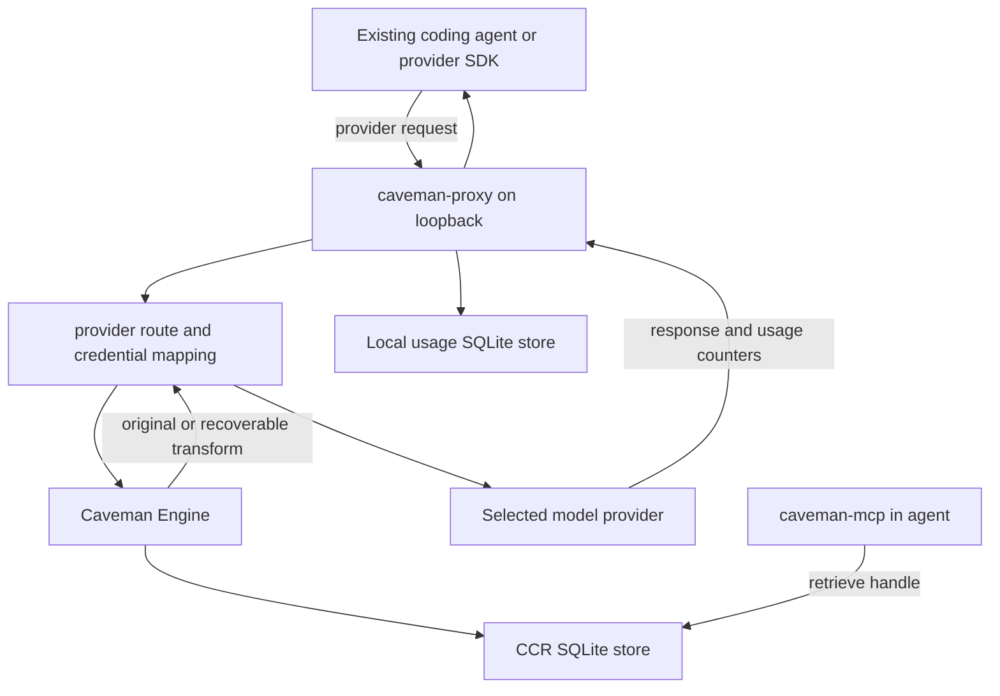

# Architecture

Caveman's local runtime is a set of small processes joined by documented files,
stdio, loopback HTTP, and Model Context Protocol (MCP). Each process owns one
boundary so failure can fall back without inventing a result.

## Local request path

The proxy is a base-URL swap. Agent code and provider request format stay in
place. Provider adapters match an allowed route, preserve or resolve the
credential, inspect the body, apply enabled transforms, forward upstream, parse
usage, and write a local row.

## Processes

| Process | Transport | Responsibility |
|---|---|---|
| `caveman` | terminal | Install, configure, launch, and inspect |
| `caveman-proxy` | loopback HTTP | Provider routing, transforms, usage capture, local native runtime |
| `caveman-engine` | stdin/stdout CLI | Direct compression, detection, recovery, TOON, Pixel, and eval commands |
| `caveman-mcp` | MCP over stdio | Five Engine tools inside an agent |
| `cavemem` | CLI or MCP over stdio | Durable memory and ranked recall |
| `caveman-browse` | MCP over stdio plus Chrome DevTools Protocol | Accessibility snapshots and browser actions |
| `caveman-shrink` | stdin/stdout CLI | Tool-catalog compression and recovery |

The JavaScript CLI locates binaries through an explicit `CAVEMAN_*_BIN`
override, then `PATH`, then `~/.caveman/bin`. Missing binaries disable only
the commands they power. Wrap is stricter: pointing an agent at a proxy that is
absent would break routing, so interactive runs offer a direct launch and
non-interactive callers must ensure the proxy is running.

## Storage

Default local state lives under `~/.caveman`:

| Path | Contents |
|---|---|
| `bin/` | Verified companion binaries |
| `caveman.db` | Local request usage, prefix replacement cache, trials, and learn data |
| `ccr.db` | Exact recovery payloads and typed working-memory objects |
| `caveman.yaml` | Proxy mode; loopback listener; provider endpoints; optimizer switches |
| `receipts/` | Local native-agent run receipts when produced |

Connected CLI state uses `~/.caveman-cloud`. Credentials use the macOS
Keychain when available, with an owner-only file fallback. Configuration stores
pointers and non-secret settings. See [security and privacy](./security-and-privacy.md)
for deletion and permission details.

## Engine boundary

Engine exposes four stable operations:

- `Compress`: detect, route, transform, count, and persist recovery
- `Retrieve`: return exact original bytes for a handle
- `Detect`: classify a payload deterministically
- `Stats`: aggregate rows stored by CCR

`Simulate` runs same detector and compressor without storing bytes, then reports
whether real compression would require CCR. Its estimate cannot authorize a live
transform.

Compressors are pure byte transforms with no access to network, storage, or
token accounting. Engine supplies those controls around each compressor.

## Recovery paths

Non-streaming API-key requests can use proxy-side handling where supported.
Streaming and subscription-auth agent sessions need an agent-side MCP recovery
path. The CLI checks that `caveman-mcp` is present and installed for the
selected agent before advertising that path.

A transformed block becomes part of later request prefixes. Caveman stores a
deterministic original-to-replacement mapping so the same source block produces
the same replacement bytes on later turns. A replacement cache miss or write
failure returns original bytes.

## Agent-native events

Supported host integrations can send lifecycle events to a user-only Unix
socket or Windows named pipe owned by the local proxy. The native runtime
normalizes events, records a task contract and decisions, and can move large
tool outputs into typed CCR objects.

Session markers are local correlation data. The proxy validates and removes
them before provider capture and forwarding. Invalid or ambiguous correlation
produces no association.

## Failure behavior

Local data-path failures favor correct provider traffic:

| Failure | Behavior |
|---|---|
| Unknown runtime mode | Use `record` |
| Unknown route | Return 404 |
| Malformed transform input | Forward original body |
| Transform output is not smaller | Forward original body |
| CCR unavailable or full | Forward original body; publish no handle |
| Unsupported provider/model transform | Forward original body |
| Unknown safety class | Do not run transform |
| Missing provider price | Mark unpriced; do not guess |
| Missing recovery MCP for a path that needs it | Leave that path uncompressed |
| Foreign process on proxy port | Do not restart or trust it |

Provider errors still reach the caller as provider errors. A transform failure
does not become a synthetic success or a client-side parse error.

## Source map

- Engine: [`engine/`](../../engine/)
- Local proxy and adapters: [`proxy/`](../../proxy/)
- CLI: [`packages/cli/`](../../packages/cli/)
- Recovery MCP: [`mcp/`](../../mcp/)
- Memory: [`mem/`](../../mem/)
- Browser: [`browse/`](../../browse/)
- Tool-catalog shrinker: [`shrink/`](../../shrink/)
- Agent profiles: [`agents/profiles/`](../../agents/profiles/)
- Public schemas: [`packages/shared/contracts/`](../../packages/shared/contracts/)
