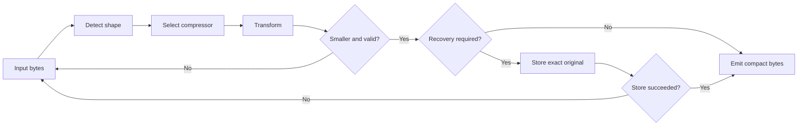

# Compression Engine

Caveman Engine is a local Go library and command-line runtime for reducing
model context. It detects input shape, chooses a matching compressor, stores
exact source when a lossy transform needs recovery, and emits output only when
the result passes size and safety checks.

Engine source is licensed under the Business Source License 1.1. Interfaces and
adoption packages use their package-level licenses. See
[`LICENSING.md`](../../LICENSING.md).

## Library calls

Four operations form stable core API:

| Operation | Purpose |
|---|---|
| `Compress` | Detect and compress input under a mode and policy |
| `Retrieve` | Recover exact original bytes from a handle |
| `Detect` | Classify input without changing it |
| `Stats` | Read local compression statistics |

`Simulate` is an auxiliary operation that evaluates a transform without
committing normal runtime effects.

Callers should treat original-byte output as a valid result. It means no
eligible transform passed all gates.

## Compression pipeline



No compressor, parse error, larger result, or recovery-store failure returns
original bytes. Unknown modes also return original bytes. `record` mode always
passes input through.

## Automatic detection

Automatic detection recognizes:

- JSON;
- terminal output;
- diffs;
- HTML;
- tabular data;
- source code;
- logs;
- search results;
- configuration text;
- general text.

Some compressors are explicit-only because automatic selection would be
ambiguous or unsafe. TOON, accessibility trees, tool-schema transforms,
repetition transforms, and tool-schema annotation transforms are not selected
by general detection.

## Compressor registry

Default registry contains 15 compressors:

1. JSON
2. log
3. code
4. diff
5. search result
6. text
7. HTML
8. tabular
9. configuration
10. tool schema
11. tool-schema annotations
12. TOON
13. accessibility tree
14. repetition
15. terminal output

Each compressor declares a safety class and implements its own parse and output
rules. Current compressors belong to lossy class S4, even when a particular
input can round-trip structurally. Callers must not infer byte safety from a
compressor name.

## Recovery requirement

A lossy result may be emitted only when exact original bytes are recoverable.
Native callers supply a recovery store. Browser builds use an in-memory store;
host runtimes normally use SQLite. If no recovery store exists, Engine keeps
original input.

See [Context recovery](context-recovery.md) for handles, limits, and object
pointers.

## Token accounting

Engine uses an offline `o200k_base` counter where available. A character-based
estimate is the fallback. Local counts therefore use an `inferred` basis unless
a provider supplies its own usage. They are useful for comparison and capacity
planning, not provider billing reconciliation.

## Input limits

CLI compression accepts input up to 64 MiB. Recovery storage has a separate
configured capacity and a default payload ceiling of 512 MiB. Inputs exceeding
limits are rejected or passed through according to caller contract; they are
never silently truncated.

## Native and WebAssembly builds

Engine can run as:

- a Go library;
- a native CLI used by the JavaScript launcher;
- a WebAssembly module for browser-compatible consumers.

Build native Engine from repository root:

```bash
go build ./engine/cmd/caveman-engine
```

Run Engine tests:

```bash
go test ./engine/...
```

WebAssembly uses in-memory recovery because browser runtimes do not expose the
host SQLite store directly.

## Adding a compressor

A new compressor needs:

1. an unambiguous name and declared safety class;
2. bounded parsing and deterministic output;
3. original-byte fallback on invalid input;
4. recovery integration for lossy output;
5. fixtures covering valid, invalid, larger-output, and boundary cases;
6. registration in the default registry only when automatic or explicit
   selection behavior is clear.

Public performance claims require committed fixtures, method, token basis, and
quality checks. See [Testing and benchmarks](testing-and-benchmarks.md).
